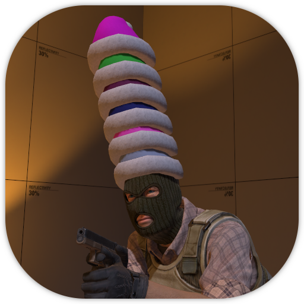

    
    <h1>xmas_hat_minigame</h1>

### What is this?

A simple festive minigame you can add to your CS2 maps, the premise is that every player spawns with a randomly coloured Christmas hat, dying will cause said hat to be dropped, other players will be able to pick up that dropped hat and stack up to 6 hats on their head. Hats will reset every round.

### How to use

- If you don't have a .vsndevts file in your addon, you can safely copy the contents of this repository into the root of your addon (you can skip unnecessary files like the icon.png and this README.md, of course).

- If you already have a .vsndevts file you need to copy the `xmas_hat_minigame.hat_bell_jiggle` soundevent from this project's [soundevents_addon.vsndevts](soundevents/soundevents_addon.vsndevts) file inside your own .vsndevts file.

- The rest of the setup process is explained with point_worldtext entities inside the example vmap located in `maps/content_examples/xmas_hat_minigame.vmap`.

- To disable hats from glowing change the `DROPPED_HAT_GLOW_ENABLE` variable inside the [xmas_hat_minigame.js](scripts/xmas_hat_minigame.js) script to false

### Known issues

- Because of a CS2 bug, spawning hat entities in dynamically causes bot spawns to break, there is not much you can do about this so it is recommended to disable the navmesh on your map if possible (just deleting the `point_nav_walkable` entity will do).